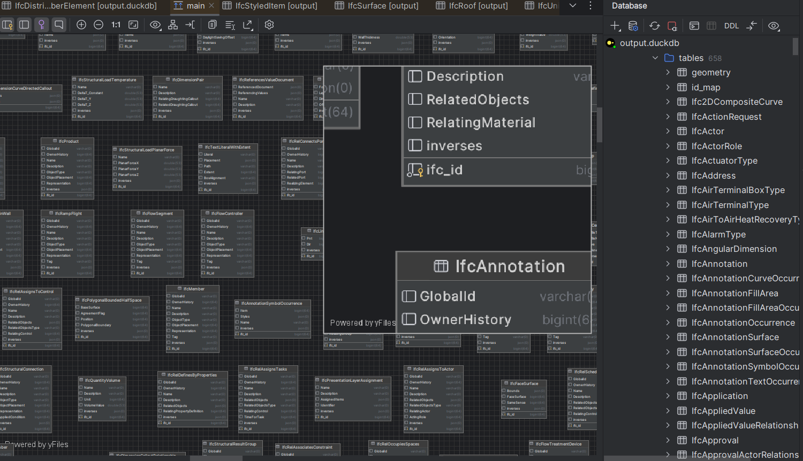

# 🏗️ IFC Smart Query System
*ממשק חכם לניתוח קובצי IFC עם AI מתקדם*

[](https://your-app-url.streamlit.app)
[](https://www.python.org/downloads/)
[](https://opensource.org/licenses/MIT)

## 🎯 מה זה?

**IFC Smart Query System** הוא כלי מהפכני שמאפשר לאדריכלים, מהנדסים ובעלי פרויקטים לשאול שאלות **בעברית טבעית** על קובצי IFC ולקבל תשובות מקצועיות וחכמות.

### 🚀 התכונות העיקריות

- **🗣️ שאלות בעברית טבעית** - "כמה קירות יש בבניין?"
- **🧠 פרשנות AI חכמה** - לא רק נתונים, אלא תובנות מקצועיות
- **👥 מותאם למקצועות** - ממשק שונה לאדריכלים, מהנדסים ובעלי פרויקטים
- **📊 Analytics מתקדם** - מעקב אחר שאלות ותובנות
- **⚡ ביצועים גבוהים** - מבוסס על DuckDB לחיפושים מהירים

## 📸 צילומי מסך

### ממשק ראשי


### דוגמת שאלה ותשובה
```
🗣️ שאלה: "כמה קירות יש בבניין?"

🧠 פרשנות חכמה:
התוצאות מראות כי בבניין יש 45 קירות.

פירוש התוצאות:
• מספר הקירות: 45 קירות הם מספר משמעותי
• הקירות כוללים: חיצוניים, פנימיים ותומכים
• חשוב להבין את סוגי הקירות לתכנון

המלצות:
1. בדיקת תכנית הבניין
2. תיאום עם מהנדס קונסטרוקציה
3. ביקורת איכות חומרים

📊 סיכום נתונים: 45 יחידות
```

## 🚀 התחלה מהירה

### דרישות מערכת
- Python 3.8+
- OpenAI API Key (אופציונלי - לפרשנות AI)
- קובץ IFC

### התקנה מהירה

```bash
# שכפול הפרויקט
git clone https://github.com/your-username/ifc-smart-query.git
cd ifc-smart-query

# התקנת dependencies
pip install -r requirements.txt

# הרצת האפליקציה
streamlit run app.py
```

### הגדרת משתני סביבה

יצירת קובץ `.streamlit/secrets.toml`:
```toml
OPENAI_API_KEY = "sk-your-api-key-here"
```

## 🎯 מקרי שימוש

### 👷‍♂️ אדריכלים
- "מה השטח הכולל של כל החדרים?"
- "כמה דלתות וחלונות יש בכל קומה?"
- "איך מחולקים החללים בבניין?"

### 🔧 מהנדסים
- "מה מידות הקורות הראשיות?"
- "כמה טונות פלדה נדרשות?"
- "איך מתנהגת המערכת המכנית?"

### 📊 בעלי פרויקטים
- "מה אחוז ההשלמה של הפרויקט?"
- "כמה עולה הפרויקט בחומרים?"
- "מתי הפרויקט יסתיים?"

## 🛠️ ארכיטקטורה טכנית

```
📁 IFC Smart Query System
├── 🎨 Frontend (Streamlit)
│   ├── שאלה חופשית
│   ├── שאלות אדריכל
│   ├── שאלות מהנדס
│   ├── שאלות בעל פרויקט
│   └── Analytics
├── 🧠 AI Layer (OpenAI GPT-4)
│   ├── תרגום עברית → SQL
│   ├── פרשנות תוצאות
│   └── המלצות מקצועיות
├── 🗄️ Database Layer (DuckDB)
│   ├── אלמנטים גיאומטריים
│   ├── מאפיינים
│   └── יחסים
└── 📊 Logging & Analytics
    ├── מעקב שאלות
    ├── ניתוח שימוש
    └── דוחות
```

## 📊 Analytics ומעקב

המערכת כוללת מערכת logging מתקדמת:

- **📈 ניתוח שימוש בזמן אמת**
- **📋 יצוא נתונים (CSV, JSON)**
- **🎯 זיהוי מגמות בשאלות**
- **⚡ מדדי ביצועים**

## 🔧 הרחבה ופיתוח

### הוספת סוגי שאלות חדשות

```python
# בקובץ ai_translator.py
new_patterns = {
    "pattern_name": {
        "keywords": ["מילה1", "מילה2"],
        "sql_template": "SELECT ...",
        "description": "תיאור הדפוס"
    }
}
```

### יצירת דשבורד חדש

```python
# יצירת טאב חדש באפליקציה
def render_new_dashboard():
    st.header("דשבורד חדש")
    # לוגיקת הדשבורד
```

## 🤝 תרומה לפרויקט

אנחנו מזמינים תרומות! 

1. **Fork** את הפרויקט
2. יצירת **branch** חדש (`git checkout -b feature/amazing-feature`)
3. **Commit** השינויים (`git commit -m 'Add amazing feature'`)
4. **Push** ל-branch (`git push origin feature/amazing-feature`)
5. פתיחת **Pull Request**

## 📄 רישיון

הפרויקט מורשה תחת [MIT License](LICENSE).

## 📞 יצירת קשר ותמיכה

- **🐛 דיווח על באגים**: [GitHub Issues](https://github.com/your-username/ifc-smart-query/issues)
- **💡 רעיונות ובקשות**: [GitHub Discussions](https://github.com/your-username/ifc-smart-query/discussions)
- **📧 יצירת קשר**: your-email@example.com

## 🔮 תכניות עתידיות

- [ ] תמיכה בפורמטים נוספים (DWG, RVT)
- [ ] API RESTful
- [ ] אפליקציית נייד
- [ ] בינה מלאכותית מתקדמת יותר
- [ ] עיבוד בזמן אמת

---

**נבנה על ידי אדריכלים ומהנדסים, עבור אדריכלים ומהנדסים** 🏗️

[](https://github.com/your-username)
[](https://streamlit.io)
[](https://openai.com)